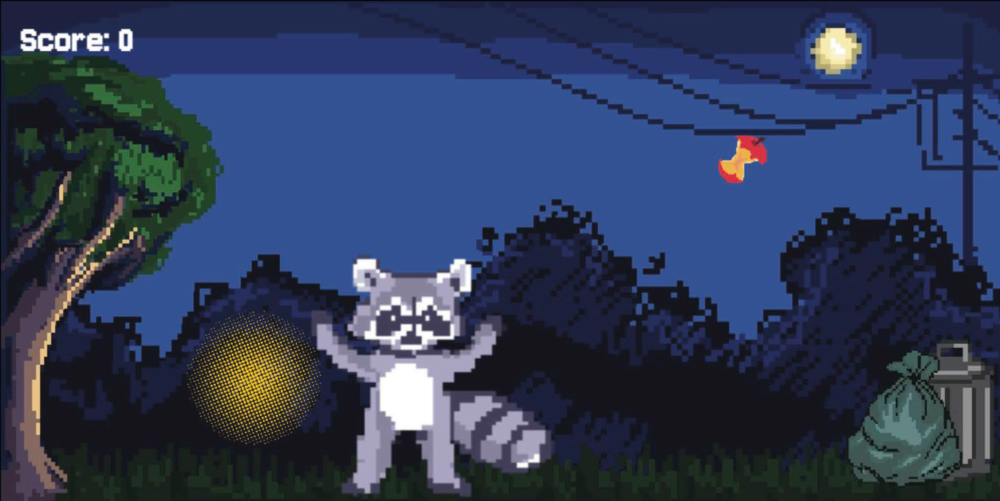
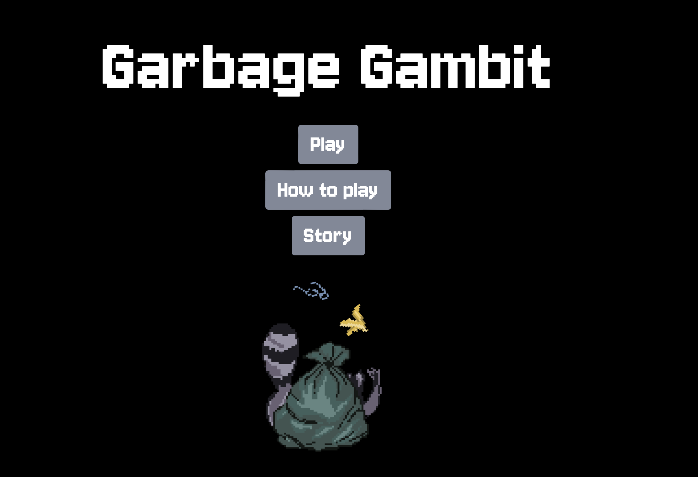
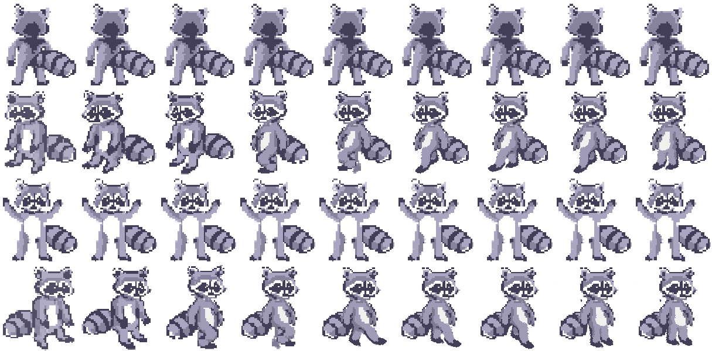
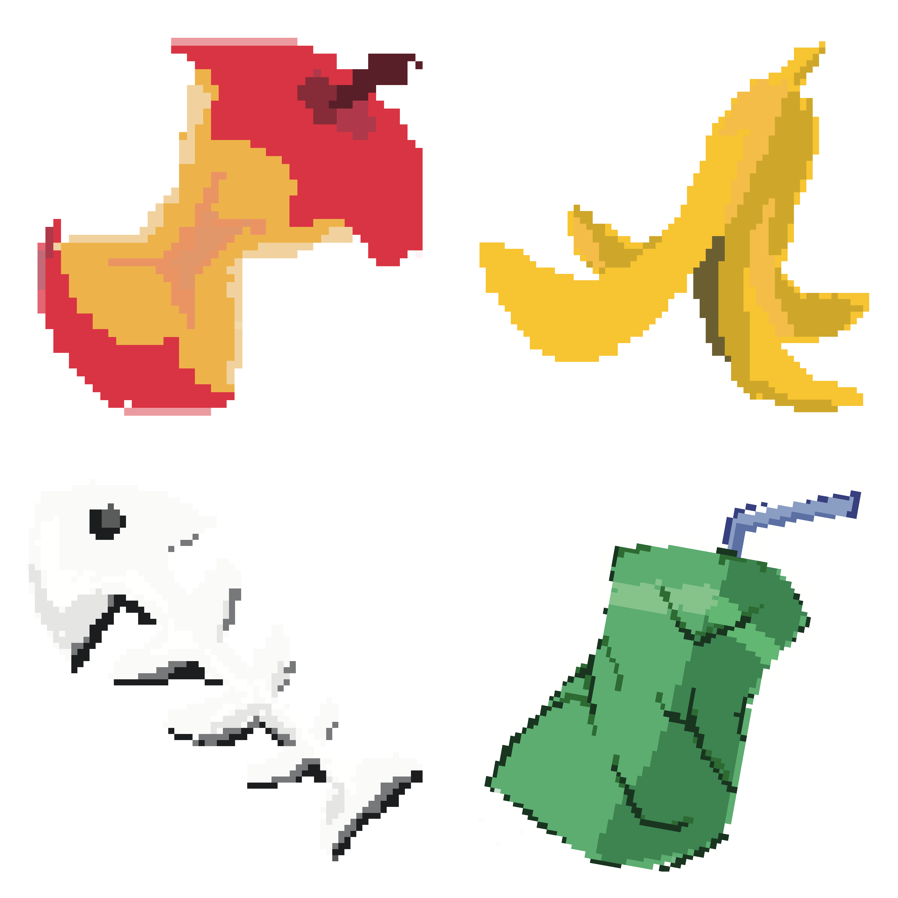
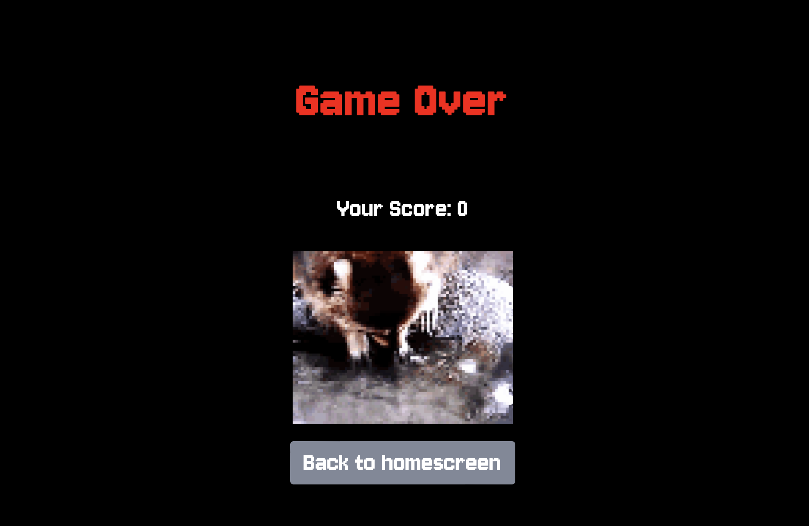

# 🦝 **Garbage Gambit** 

> **Short Pitch**: You’re a raccoon in the backyard of some doofus.
> Whenever he shines the light on you - don't move and puff yourself up to scare him away. 
> In the meantime collect as much trash for your treasure as you can!
> 
> *Collect-and-avoid type of game. Use the keys W A D to move and Q to pose*  

---

## 🌐 **Play the Game**
[Click here to play the game!]([https://your-github-username.github.io/repository-name](https://sofijasof.github.io/CreativeCodingLabWS24/))

---

## 📸 **Screenshots**

### Main Gameplay:

  
  
*Figure 1: Example of gameplay in action.*

---

### Menu and UI:

  
  
*Figure 2: Menu and user interface.*

---

## 🎨 **Spritesheets**
Below are the sprites used to create characters and objects in the game:

### Player Character:

  
  
*Figure 3: Player character animations.*

---

### Collectable trash items you should get to up your score

  
  
*Figure 4: Collectable trash items*

---

### The light (Enemy) you should avoid:

  
  
*Figure 4: "Enemy" you should avoid/ scare off*

---

### Game Over Screen:

  
  
*Figure 4: Game over screen that shows up when you loose*

---

## ✍️ **Reflection**

### What went well:
- **Creative Design:** The idea is fun and memeable which makes it memorable
- **Focus:** I kept my focus on the most important mechanisms and managed to finish everything I've planned
- **Gameplay:** The gameplay adds a little twist to the usual jump and run game 

### Challenges:
- **Time Constraints:** Pixel Art was a new territory for me, and while Momo gave us a pretty good introduction, it was still time consuming to actually create something own in this art style 
- **Bug Fixes:** Toggling between Hiding/Showing the Main/Game Over Screen and the Game Canvas was taking a lot of time, because it took me some time to understand the logic

### Lessons Learned:
- **Talking to others & asking for help:** It's always good to get some fresh eyes on your work / code
- **Keep it Simple:** Instead of getting overwhelmed by too many todo's, focus on what matters most
- **Time Management:** This two weeks showed me how much you can accomplish in two weeks.. but also how little time two weeks are
